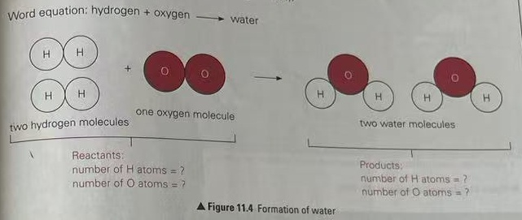
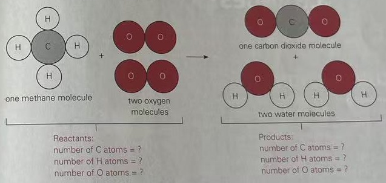

## REPRESENTING CHEMICAL REACTIONS

We use word equations to show the substances that are involved in chemical reactions. A word equation includes the reactant(s) used and the product(s) formed in a chemical reaction. At times, it also shows the condition(s) under which a chemical reaction occurs.

In a word equation, the reactants used in a chemical reaction are shown on the left-hand side. The products formed in the reaction are shown on the right-hand side of the word equation.

For example, methane, a type of fuel, reacts with oxygen to form carbon dioxide and water. Heat is the condition needed for the chemical reaction to occur. The word equation for this chemical reaction is:

The word equation for another chemical reaction is shown below.

## REARRANGEMENT OF ATOMS IN A CHEMICAL REACTION

During a chemical reaction, atoms of the reactants rearrange themselves and combine chemically to form products. The atoms of the products are always obtained from the reactants.

For example, one carbon atom and two oxygen atoms that make up an oxygen molecule combine chemically to form one carbon dioxide molecule (Figure 11.3).

## CONNECT THE DOTS

Activity Book 2A:

11.1.3 Looking

Closely at Chemical

Reactions

pages 73–74

## CONNECT THE DOTS

Activity Book 2A: 11.1.2 How Do We Represent Chemical Reactions? page 71

▲ Figure 11.3 Formation of carbon dioxide

Atoms are neither created nor destroyed in a chemical reaction. Let us look at two examples on the next page.

## Example 1

Hydrogen reacts with oxygen to form water (Figure 11.4).

Word equation: hydrogen + oxygen  $ \longrightarrow $ water

## Example 2

Methane reacts with oxygen to form carbon dioxide and water (Figure 11.5).

Word equation: methane + oxygen  $ \longrightarrow $ carbon dioxide + water

▲Figure 11.5 Reaction of methane and oxygen

Count the number of each type of atoms on the left-hand side and right-hand side of the equation in Figures 11.4 and 11.5. What can you conclude?

The total number of atoms before and after a chemical reaction is balanced. This means that the number of each type of atom remains the same during the reaction.

Atoms of reactants combine in different ways to form products, but no atoms are lost or formed in a chemical reaction. Thus, the mass of the reactants is equal to the mass of the products. We say that mass is conserved during a chemical reaction.